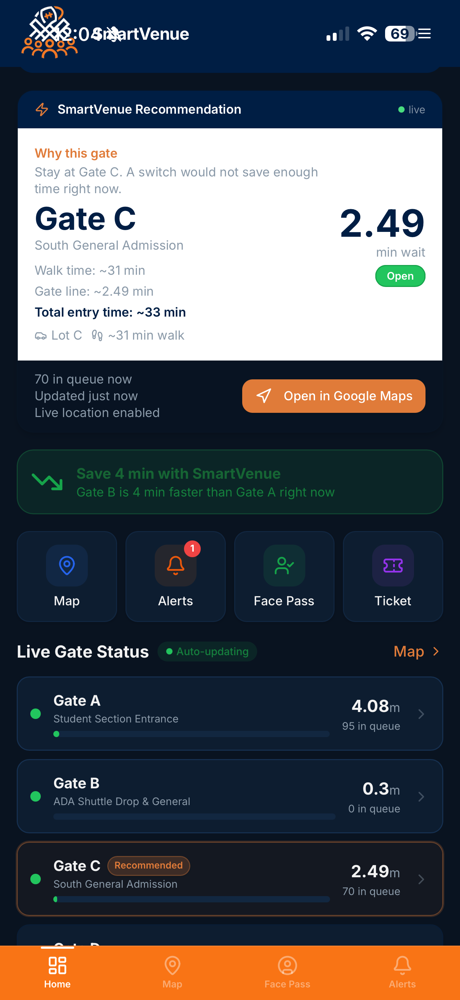
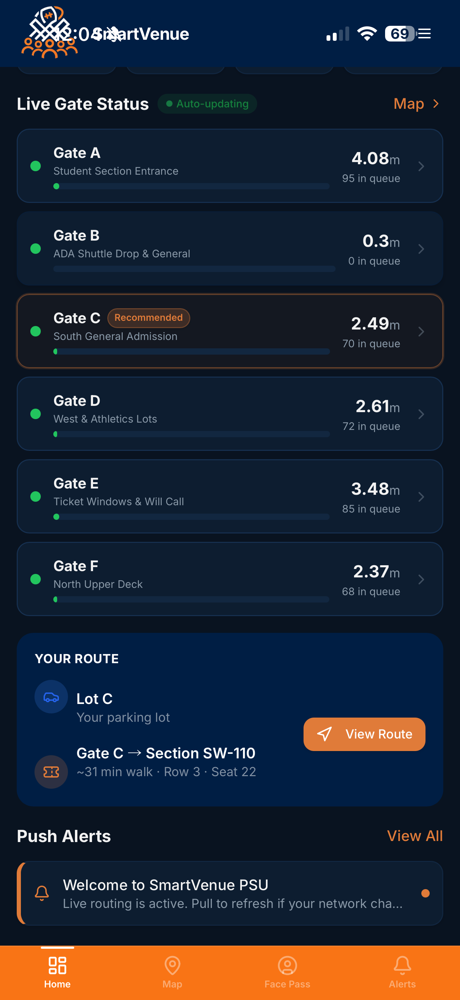
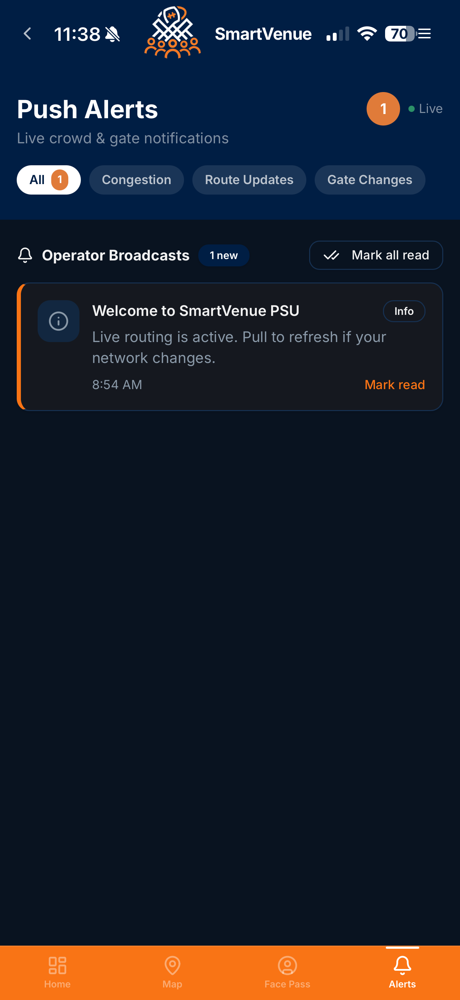

# SmartVenue

SmartVenue is a stadium-entry demo app for Beaver Stadium that combines:

- live crowd detection and gate congestion updates
- personalized gate recommendation
- Face Pass enrollment and kiosk verification
- QR ticket fallback
- iPhone/Xcode wrapper support

This repo now contains the current SmartVenue work alongside the older `SmartEvent/` files that already existed in the GitHub repo.

## Main folders

- `smartevent2/`
  - current web app frontend
- `smartvenue-cameraengine/`
  - routing backend and crowd camera integration
- `Playground/Playground/smartvenue/kiosk/`
  - kiosk face verification services
- `SmartVenueWrapperIOS/`
  - SwiftUI iPhone wrapper for presenting the web app on-device

## Demo screenshots







## What is currently used for the demo

For the latest working demo flow, use:

- frontend: `smartevent2`
- backend: `smartvenue-cameraengine/engine/main.py`
- kiosk registration service: `Playground/Playground/smartvenue/kiosk/register-face.py`
- kiosk recognition service: `Playground/Playground/smartvenue/kiosk/ml-service.py`

## Prerequisites

- Python 3
- Node.js + npm
- AWS credentials configured in `~/.aws/credentials` and `~/.aws/config`
- camera access enabled for Terminal / Python on macOS

Optional but useful:

- iPhone + Xcode for the wrapper demo
- Continuity Camera if you want to use the phone camera as the kiosk camera

## Run the full project

Open separate terminals for each service.

### 1. Main routing backend

```bash
cd /Users/krishang/Documents/New\ project
python3 -m uvicorn smartvenue-cameraengine.engine.main:app --host 0.0.0.0 --port 8000 --app-dir /Users/krishang/Documents/New\ project
```

### 2. Frontend app

```bash
cd /Users/krishang/Documents/New\ project/smartevent2
npm install
npm run dev -- --host 0.0.0.0 --port 5173
```

### 3. Kiosk registration service

```bash
cd /Users/krishang/Documents/New\ project/Playground/Playground/smartvenue/kiosk
python3 -m uvicorn register_face:APP --host 0.0.0.0 --port 5001
```

### 4. Kiosk recognition service

```bash
cd /Users/krishang/Documents/New\ project/Playground/Playground/smartvenue/kiosk
python3 -m uvicorn ml_service:APP --host 0.0.0.0 --port 5050
```

### 5. Optional crowd camera detector for Gate B

```bash
cd /Users/krishang/Documents/New\ project/smartvenue-cameraengine/camera
SMARTVENUE_ROUTING_ENGINE_URL=http://104.39.179.63:8000/api/camera/update python3 gate_b_camera_launcher.py
```

## URLs to open

### User app

- [http://104.39.179.63:5173](http://104.39.179.63:5173)

### Kiosk verification page

- [http://104.39.179.63:5173/gate-verify](http://104.39.179.63:5173/gate-verify)

### Backend docs

- [http://104.39.179.63:8000/docs](http://104.39.179.63:8000/docs)

### Raw kiosk recognition endpoints

- [http://127.0.0.1:5050/health](http://127.0.0.1:5050/health)
- [http://127.0.0.1:5050/recognition](http://127.0.0.1:5050/recognition)
- [http://127.0.0.1:5050/frame.jpg](http://127.0.0.1:5050/frame.jpg)

## Face Pass flow

1. Open the app.
2. Go to `Face Pass`.
3. Upload a selfie and activate Face Pass.
4. This stores the profile in the app data and syncs the face to the kiosk flow.
5. Open `/gate-verify`.
6. Stand in front of the kiosk camera.
7. If matched, the kiosk shows ticket details.
8. If no match, it keeps the fallback `Face Pass Not Found` behavior.

## AWS Rekognition notes

The kiosk recognition flow is set up to use Amazon Rekognition as the primary matcher.

Current behavior:

- local face detection finds and crops the face
- the cropped face is compared against enrolled Face Pass selfies
- if Rekognition finds a match, the kiosk shows that fan's ticket details
- if no match is found, the kiosk falls back to the existing non-enrolled behavior

Configured files:

- `~/.aws/credentials`
- `~/.aws/config`

## iPhone / Xcode wrapper

The iPhone wrapper source is in:

- `SmartVenueWrapperIOS/`

Important setup doc:

- `SmartVenueWrapperIOS/XCODE_SETUP.md`

Make sure the iOS target has:

- location permission
- camera permission
- photo library permission
- ATS exception for local HTTP if needed

## Troubleshooting

### Kiosk says camera unavailable

- make sure Terminal 4 is running
- open `http://127.0.0.1:5050/frame.jpg`
- check macOS camera permissions

### Face Pass saves but kiosk does not match

- re-enroll the selfie with good lighting
- restart Terminal 3 and Terminal 4
- verify AWS credentials are still present

### Crowd model does not update

- make sure backend on `8000` is running
- test `GET /api/gates/live`
- if using the Gate B camera detector, confirm that the detector terminal is sending updates

## Project notes

- `SmartEvent/` and some root files came from the existing GitHub repo and were preserved
- `smartevent2/` is the newer working frontend used in the current demo
- `Playground/Playground/` contains additional kiosk and MVP experiments that are included for reference and demo assets
